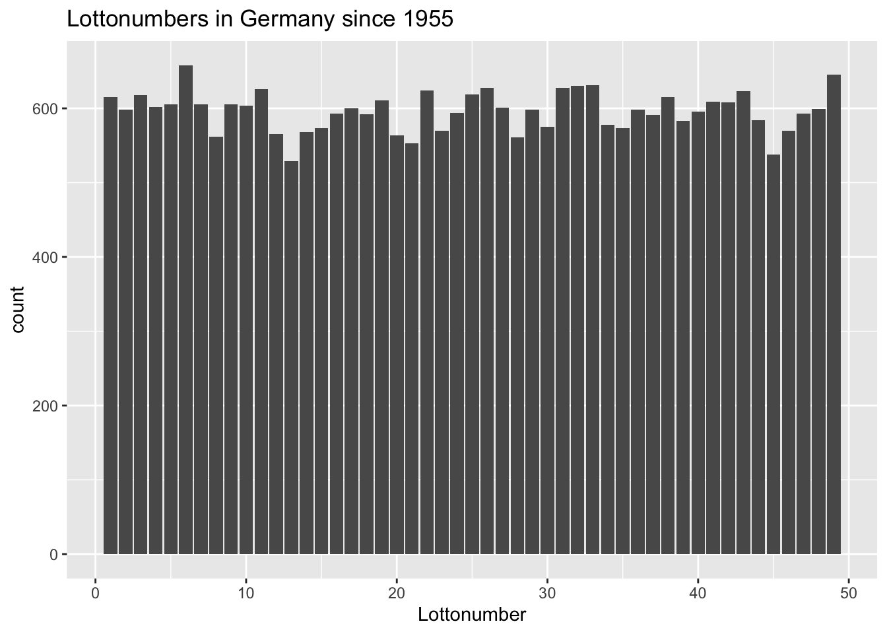

<!-- README.md is generated from README.Rmd. Please edit that file -->

# API for the lotto numbers of the german lottery (1955-2020)

[](http://www.repostatus.org/#active)

## Background

This repo provides the german lotto numbers from 1955 - today in one
single file. All people who are interested in data analysis or just to
“calculate” their chances to win the lottery are invited to use the
data.

Two JSON files are give: Choose the one you can work with :-)

## Data analysis examples

The data provided is a JSON file and readable by all modern software
languages. In the following two examples are shown (R and Python).

### R

The package [tidyverse](https://www.tidyverse.org) is able to analyze
the data very quickly with R.

In the next chunk, all data are read, filtered (just taking the lotto
numbers) and grouped by the values and counted the number of appearance.
We can see, that lotto number 6 is the most frequent number.

``` r
library(tidyverse)
library(jsonlite)
library(lubridate)

data <- fromJSON("https://johannesfriedrich.github.io/LottoNumberArchive/Lottonumbers_tidy_complete.json")

lottonumbers_count <- data %>% 
  filter(variable == "Lottozahl") %>% 
  group_by(value) %>% 
  summarise(count = n())
```

``` r
lottonumbers_count %>% 
  arrange(desc(count)) %>% 
  top_n(5)
## Selecting by count
## # A tibble: 5 x 2
##   value count
##   <int> <int>
## 1     6   606
## 2    49   587
## 3    32   584
## 4    38   582
## 5    11   579
```

Now we want to summarise all numbers from 1-49 and their appearance.

``` r
library(ggplot2)

ggplot(lottonumbers_count, aes(value, count)) +
  geom_bar(stat = "identity") +
  labs(x = "Lottonumber", title = "Lottonumbers in Germany since 1955")
```



Since 2001 in the german lottery a number called “Zusatzzahl” was
introduced. Every Wednesday and Saturday the number chosen. The
following graph shows the distribution of the Zusatzzahl.

``` r
superzahl <- data %>% 
  filter(variable == "Superzahl") %>% 
  mutate(date = dmy(date),
         Day = weekdays(date),
         year = year(date)) %>% 
  filter(year >= 2001) %>% 
  group_by(value, Day) %>% 
  summarise(count = n())
## `summarise()` regrouping output by 'value' (override with `.groups` argument)
```

``` r
ggplot(superzahl, aes(value, count, fill = Day)) +
  geom_bar(stat = "identity", position = "dodge") +
  scale_x_continuous(breaks = c(0:9)) +
  labs(x = "Zusatzzahl", title = "Zusatzzahl since 2001")
```


What were the numbers most chosen in 2020?

``` r
data %>% 
  filter(variable == "Lottozahl") %>% 
  mutate(date = dmy(date),
         year = year(date)) %>% 
  filter(year == 2020) %>% 
  group_by(value) %>% 
  summarise(count = n()) %>% 
   arrange(desc(count)) %>% 
  top_n(5)
## `summarise()` ungrouping output (override with `.groups` argument)
## Selecting by count
## # A tibble: 5 x 2
##   value count
##   <int> <int>
## 1    11    25
## 2     2    21
## 3     1    18
## 4    22    18
## 5     8    17
```

### Python

In python the module [pandas](http://pandas.pydata.org) is very handy to
analyse data. In the following the same analysis as shown above will be
executed.

``` python
import pandas as pd

data = pd.read_json("https://johannesfriedrich.github.io/LottoNumberArchive/Lottonumbers_tidy_complete.json")

res = data[data.variable == "Lottozahl"].groupby("value")["value"].count().sort_values(ascending = False)

print(res.head(5))
## value
## 6     606
## 49    587
## 32    584
## 38    582
## 11    579
## Name: value, dtype: int64
```
